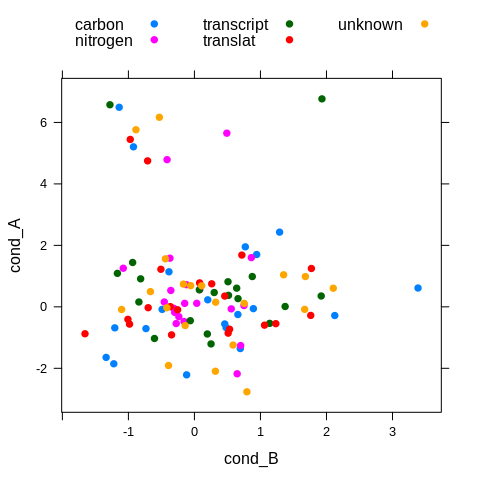
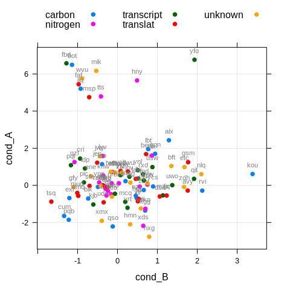
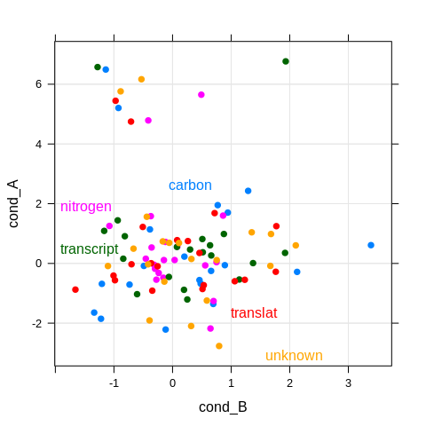

How to label points on a scatterplot with R (for lattice)
================

The famous **ggplot2** package for R has numerous packages extending its
basic plot functions, including **ggrepel** that draws nice text labels
for each point of a scatterplot. But I am using **lattice** for many
years now, and came to like its look and customization options. However,
one thing I was missing all the time is a simple one-line function to
add small text labels to points in a scatter plot (a.k.a. dot plot,
a.k.a. `xyplot()` in lattice).

It’s not that there are no functions for text labels out there, it’s
just that lattice plots are not compatible with the ggplot universe, and
other more hacky solutions are not really appealing. Finally I got so
frustrated that I wrote my own panel function for text labels of points.
Here is what I’ve gone through.

-----

### The problem

In computational biology (just as in any other data science field) we
very, very often encounter the situation that we want to compare two
biological conditions to each other, such as a control condition
*versus* a treatment (e.g. bacteria grown on substrate A versus
substrate B). But for each condition we have several thousands of
measurements obtained in parallel, thanks to the ’Omics revolution. Now
the question is, which single protein or transcript is the most
interesting (or differentially expressed) between the two conditions?
One of the easiest ways to look at the data is to plot condition A
versus B.

``` r
# attach packages
library(lattice)
library(latticeExtra)
library(directlabels)

# simulate data with a couple of outliers
df <- data.frame(
  gene = paste0(
    sample(letters, 100, replace = TRUE),
    sample(letters, 100, replace = TRUE),
    sample(letters, 100, replace = TRUE)),
  cond_A = c(rnorm(90), rnorm(10, 6)),
  cond_B = rnorm(100),
  pathway = rep(c("transcript", "translat", 
    "carbon", "nitrogen", "unknown"), 20)
)

head(df)
```

    ##   gene      cond_A      cond_B    pathway
    ## 1  ynl  0.81610752  0.50860298 transcript
    ## 2  vcb  0.77903975  0.07852623   translat
    ## 3  bik -0.70903387 -0.73387667     carbon
    ## 4  bym -0.04559753 -0.31385190   nitrogen
    ## 5  bft  1.04192395  1.35110333    unknown
    ## 6  qit  0.35243408  1.92016239 transcript

``` r
# change default plot symbol
theme <- trellis.par.get()
theme$superpose.symbol$pch = 19

# plot using lattice
xyplot(cond_A ~ cond_B, df,
  groups = pathway, 
  par.settings = theme,
  auto.key = list(columns = 3))
```

<!-- -->

### The hacky approach

Now we want to know quickly what these points are that appear to be
up-regulated under condition A. The hacky way is to use a panel function
that we construct on the fly.

``` r
xyplot(cond_A ~ cond_B, df,
  groups = pathway, 
  par.settings = theme,
  auto.key = list(columns = 3),
  panel = function(x, y, ...) {
    panel.grid(h = -1, v = -1, col.line = grey(0.9))
    panel.xyplot(x, y, ...)
    # function that puts text labels above/below points
    panel.text(x, y, labels = df$gene, 
      col = grey(0.5), cex = 0.7, pos = 3, offset = 1)
  }
)
```

<!-- -->

The **problems are obvious**. It’s inconvenient to think about proper
placement of labels for every new plot (below or above points, how far
away?); Labels are overlapping with each other due to the rigid way we
place them; To plot only a few labels we would have to make tedious
manual selection of points using additional variables; Grouping is
ignored for the labels and it’s not straight forward to implement it, so
we have to go with the simple solution of painting them all grey. I
often found myself moving labels around in Inkscape and deleting the
unwanted ones, which is really not efficient if you do it twice per
week.

### The `directlabels` package

There is at least one sophisticated package for drawing text labels in
lattice *and* ggplot2, the `directlabels` package
([link](http://directlabels.r-forge.r-project.org)). The idea behind
this package is to provide functions for labeling points, lines or other
objects in a variety of plots, not only scatterplots. It is a well-made
and comprehensive package with many options for customization, but it’s
not the right tool for our problem: It builds heavily on the idea of
grouping variables and will **only place one label per group, not per
point**.

``` r
dotplot <- xyplot(cond_A ~ cond_B, df,
  groups = pathway,
  par.settings = theme,
  panel = function(x, y, ...) {
    panel.grid(h = -1, v = -1, col.line = grey(0.9))
    panel.xyplot(x, y, ...)
  }
)

direct.label(dotplot)
```

<!-- -->

That’s not really what I want, although it is quite useful for other
purposes. In fact we can also set `groups = gene` and *will* get
individual gene labels, but they are distributed over the entire plot
area, and we lose our grouping by pathway.

### The dedicated panel function

In the end I made my own panel function, `panel.directlabel` that you
can find in my `lattice-tools` package on github (you might also just
download only the function itself if you want).

``` r
require(devtools)
devtools::install_github("https://github.com/m-jahn/lattice-tools")
```

The function has all the different options that I want to customize text
labels, like connecting lines to the points, boxes around labels,
flexible sizing, subsetting based on x and y thresholds, and consistency
with grouping. The placement of labels is determined using the method
`smart.grid` from `directlabels`. And here is the final plot using some
of the custom options.

``` r
library(latticetools)

xyplot(cond_A ~ cond_B, df,
  groups = pathway,
  par.settings = theme,
  labels = df$gene, cex = 0.75,
  auto.key = list(columns = 3),
  panel = function(x, y, ...) {
    panel.grid(h = -1, v = -1, col.line = grey(0.9))
    panel.xyplot(x, y, ...)
    panel.directlabel(x, y, y_boundary = c(4, 10), 
      draw_box = TRUE, box_line = TRUE, ...)
  }
)
```

<!-- -->

Now we can quickly see what our points of interest are. Plus, colors
from grouping are preserved for lines, boxes, and text of the label.
Labels don’t overlap because the underlying method for placement is
‘smart’ enough to push them to free areas. I just selected a subset of
interesting points to be labelled using the `y_boundary` option. And of
course, the appearance of boxes, lines, and so on can be easily
customized.
